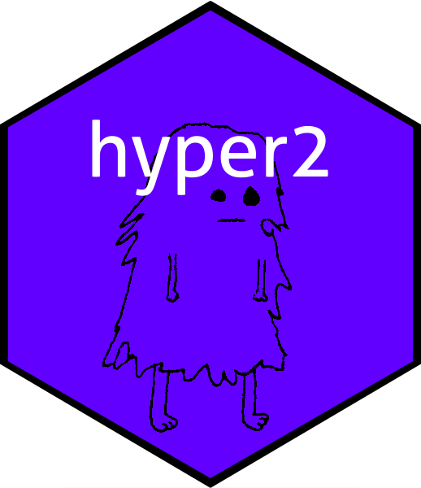

The hyper 2 package
================

<!-- README.md is generated from README.Rmd. Please edit that file -->



<!-- badges: start -->

[](https://CRAN.R-project.org/package=hyper2)
[](https://cran.r-project.org/package=hyper2)
<!-- badges: end -->

# Overview

The `hyper2` package gives a suite of methods for creating and analysing
likelihood functions generated from a generalization of the
Bradley-Terry probability model. The package uses the `STL` map class of
`C++` for efficiency; it conforms to `disordR` discipline.

# Installation

The released version of `hyper2` on [CRAN](https://CRAN.R-project.org)
may be installed with:

``` r
# install.packages("hyper2")  # uncomment this to install the package
library("hyper2")
```

# Further information

For more detail, see the package vignette; type

`vignette("hyper2")`

at the R command line.

# Citation

To cite the `hyper2` package in publications, please use

Robin K. S. Hankin 2017. “Partial rank data with the `hyper2` package:
Likelihood functions for generalized Bradley-Terry models”. *The R
Journal*, 9(2):429–439
