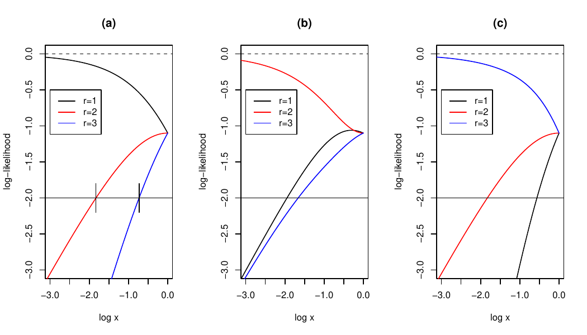

```{r setup, include=FALSE}
set.seed(1)
knitr::opts_chunk$set(echo = TRUE)
library("hyper2")
library("knitr")
```

```{r out.width='20%', out.extra='style="float:right; padding:10px"',echo=FALSE}
knitr::include_graphics(system.file("help/figures/hyper2.png", package = "hyper2"))
```

To cite the `hyper2` package in publications, please use @hankin2017_rmd.

Document `hankin-exponential_BT.tex` refers.

```{r, label=showthree, echo=FALSE, out.width = "100%",fig.cap="(a), robs=1; (b), robs=2; (c), robs=3"}
  # file 123all.png created from
                                       # 123all.pdf, which is produced
                                       # by exponential_BT.Rmd
```

So what we are going to do is to find out the sampling distribution
for the maximum likelihood estimator, conditional on
$r_\text{true}=1,2,3$.  Recall that the BT strengths for the three
competitors are $x^1,x^2,x^3$, and we use standard Plackett-Luce
likelihoods for the order statistics.


We need to find where the $r=1$ and $r=2$ lines cross at
$\sqrt{(\sqrt{5}-1)/2}\simeq 0.786$.


# First case:  $x<\sqrt{(\sqrt{5}-1)/2}$: nice and well behaved

Here the lines behave themselves and the MLEs are easy:

$r_\text{obs}=1\longrightarrow \hat{r}=1$

$r_\text{obs}=2\longrightarrow \hat{r}=2$

$r_\text{obs}=3\longrightarrow \hat{r}=3$


## First: $r_\text{true}=1$ {-}

\begin{eqnarray}
P(r_\text{obs}=1)
&=& P({\mathbf 1}\succ 2\succ 3) + P({\mathbf 1}\succ 3\succ 2)\\
&=&\frac{x^1}{x^1+x^2+x^3}\\
&=&\frac{1}{1+x+x^2}\\
&{}&\\
P(r_\text{obs}=2) &=& P(2\succ {\mathbf 1}\succ 3) + P(3\succ {\mathbf
1}\succ 2)\\
&=& \frac{x^2}{x^1+x^2+x^3}\cdot\frac{x^1}{x^1+x^3} +
    \frac{x^3}{x^1+x^2+x^3}\cdot\frac{x^1}{x^2+x^3}\\
&=& \frac{1}{1+x}+\frac{1}{1+x^2}-\frac{2}{1+x+x^2}\\
&{}&\\
P(r_\text{obs}=3) &=& P(2\succ 3\succ {\mathbf 1}) + P(3\succ 2\succ
{\mathbf 1})\\
&=& \frac{x^2}{x^1+x^2+x^3}\cdot\frac{x^3}{x^1+x^3} +
    \frac{x^3}{x^1+x^2+x^3}\cdot\frac{x^2}{x^1+x^3}\\ 
&=& 1-\frac{1}{1+x}-\frac{1}{1+x^2}+\frac{1}{1+x+x^2}
\end{eqnarray}

So we can see that $P(r_\text{obs}=1) + P(r_\text{obs}=2) +
P(r_\text{obs}=3)=1$.


## Second: $r_\text{true}=2$ {-}

\begin{eqnarray}
P(r_\text{obs}=1)
&=& P({\mathbf 2}\succ 1\succ 3) + P({\mathbf 2}\succ 3\succ 1)\\
&=&\frac{x^2}{x^1+x^2+x^3}\\
&=&\frac{x}{1+x+x^2}\\
&{}&\\
P(r_\text{obs}=2) &=& P(1\succ {\mathbf 2}\succ 3) + P(3\succ {\mathbf
2}\succ 1)\\
&=& \frac{x^1}{x^1+x^2+x^3}\cdot\frac{x^2}{x^2+x^3} +
    \frac{x^3}{x^1+x^2+x^3}\cdot\frac{x^2}{x^1+x^2}\\
&=& 1-\frac{2x}{1+x+x^2}\\
&{}&\\
P(r_\text{obs}=3) &=& P(1\succ 3\succ {\mathbf 2}) + P(3\succ 1\succ
{\mathbf 2})\\
&=& \frac{x^1}{x^1+x^2+x^3}\cdot\frac{x^3}{x^2+x^3} +
    \frac{x^3}{x^1+x^2+x^3}\cdot\frac{x^1}{x^1+x^3}\\ 
&=&\frac{x}{1+x+x^2}
\end{eqnarray}

again $P(r_\text{obs}=1) + P(r_\text{obs}=2) + P(r_\text{obs}=3)=1$.


## Lastly: $r_\text{true}=3$ {-}

\begin{eqnarray}
P(r_\text{obs}=1)
&=& P({\mathbf 3}\succ 2\succ 1) + P({\mathbf 3}\succ 1\succ 2)\\
&=&\frac{x^3}{x^1+x^2+x^3}\\
&=&\frac{x^2}{1+x+x^2}\\
&{}&\\
P(r_\text{obs}=2) &=& P(1\succ {\mathbf 3}\succ 2) + P(2\succ {\mathbf
3}\succ 1)\\
&=& \frac{x^1}{x^1+x^2+x^3}\cdot\frac{x^3}{x^2+x^3} +
    \frac{x^2}{x^1+x^2+x^3}\cdot\frac{x^3}{x^1+x^3}\\
&=& \frac{x+2x^3+x^4}{(1+x)(1+x^2)(1+x+x^2)}
&{}&\\
P(r_\text{obs}=3) &=& P(1\succ 2\succ {\mathbf 3}) + P(2\succ 1\succ
{\mathbf 3})\\
&=& \frac{x^1}{x^1+x^2+x^3}\cdot\frac{x^2}{x^1+x^3} +
    \frac{x^2}{x^1+x^2+x^3}\cdot\frac{x^1}{x^1+x^3}\\ 
&=& \frac{1+x+2x^2}{(1+x)(1+x^2)(1+x+x^2)}
\end{eqnarray}

again $P(r_\text{obs}=1) + P(r_\text{obs}=2) + P(r_\text{obs}=3)=1$
(although this is harder to see).

## inferences


$$
r_\text{true}=1\longrightarrow\begin{cases}
r_\text{obs}=1\longrightarrow\hat{r}=1\,\mbox{with probability $p_1$}\\
r_\text{obs}=2\longrightarrow\hat{r}=2\,\mbox{with probability $p_2$}\\
r_\text{obs}=3\longrightarrow\hat{r}=3\,\mbox{with probability $p_3$}\\
\end{cases}
$$

$$
r_\text{true}=2\longrightarrow\begin{cases}
r_\text{obs}=1\longrightarrow\hat{r}=1\,\mbox{with probability $p_1$}\\
r_\text{obs}=2\longrightarrow\hat{r}=2\,\mbox{with probability $p_2$}\\
r_\text{obs}=3\longrightarrow\hat{r}=3\,\mbox{with probability $p_3$}\\
\end{cases}
$$

$$
r_\text{true}=2\longrightarrow\begin{cases}
r_\text{obs}=1\longrightarrow\hat{r}=1\,\mbox{with probability $p_1$}\\
r_\text{obs}=2\longrightarrow\hat{r}=2\,\mbox{with probability $p_2$}\\
r_\text{obs}=3\longrightarrow\hat{r}=3\,\mbox{with probability $p_3$}\\
\end{cases}
$$

### Expectation for $r_\text{true}=1$:

\begin{eqnarray}
r_\text{true} &=& 1
\longrightarrow\\
\mathbb{E}(\hat{r}) &=& 
1\times\left(\frac{1}{1+x+x^2}\right) + 
2\times\left(\frac{1}{1+x}+\frac{1}{1+x^2}-\frac{2}{1+x+x^2}\right)  + 
3\times\left(1-\frac{1}{1+x}-\frac{1}{1+x^2}+\frac{1}{1+x+x^2}\right)\\
&=& 3-\frac{1}{1+x}-\frac{1}{1+x^2}\\
&\longrightarrow& 1\qquad\mbox{as $x\longrightarrow 0$}
\end{eqnarray}

### MSE for $r_\mathrm{true}=1$:

\begin{eqnarray}
r_\text{true} &=& 1
\longrightarrow\\
\mathbb{E}(\hat{r}-r_\text{true})^2 &=& 
(1-1)^2\times\left(\frac{1}{1+x+x^2}   \right)  +
(2-1)^2\times\left(\frac{1}{1+x}+\frac{1}{1+x^2}-\frac{2}{1+x+x^2}\right)  + 
(3-1)^2\times\left(1-\frac{1}{1+x}-\frac{1}{1+x^2}+\frac{1}{1+x+x^2}\right)\\
&=&
\left(\frac{1}{1+x}+\frac{1}{1+x^2}-\frac{2}{1+x+x^2}\right)  + 
4\left(1-\frac{1}{1+x}-\frac{1}{1+x^2}+\frac{1}{1+x+x^2}\right)\\
&=& 4-\frac{3}{1+x}-\frac{3}{1+x^2}+\frac{2}{1+x+x^2}\\
&\longrightarrow& 0\qquad\mbox{as $x\longrightarrow 0$}
\end{eqnarray}

## Now $r_\text{true}=2$:

### Expectation for $r_\text{true}=2$:

\begin{eqnarray}
r_\text{true} &=& 2
\longrightarrow\\
\mathbb{E}(\hat{r}) &=& 
1\times\left(\frac{x}{1+x+x^2}                        \right)  +
2\times\left(1-\frac{2x}{1+x+x^2}                     \right)  + 
3\times\left(\frac{x}{1+x+x^2}                        \right)\\ 
&=& 2 (!)
\end{eqnarray}

### MSE for $r_\text{true}=2$:

\begin{eqnarray}
r_\text{true} &=& 2
\longrightarrow\\
\mathbb{E}(\hat{r}-r_\text{true})^2 &=& 
(1-2)^2\times\left(\frac{x}{1+x+x^2}   \right)  +
(2-2)^2\times\left(1-\frac{2x}{1+x+x^2}\right)  + 
(3-2)^2\times\left(\frac{x}{1+x+x^2}\right)\\
&=&
\left(\frac{x}{1+x+x^2}\right)  + 
\left(\frac{x}{1+x+x^2}\right)\\
&=& \frac{2x}{1+x+x^2}\\
&\longrightarrow& 0\qquad\mbox{as $x\longrightarrow 0$}
\end{eqnarray}


## Now $r_\text{true}=3$:

### Expectation for $r_\text{true}=3$:

\begin{eqnarray}
r_\text{true} &=& 3
\longrightarrow\\
\mathbb{E}(\hat{r}) &=& 
1\times\left(\frac{x^2}{1+x+x^2}                        \right)  +
2\times\left(\frac{x+2x^3+x^4}{(1+x)(1+x^2)(1+x+x^2)}   \right)  + 
3\times\left(\frac{1+x+2x^2  }{(1+x)(1+x^2)(1+x+x^2)}   \right)\\
&=& 1+\frac{1}{1+x} + \frac{1}{1+x^2}
\end{eqnarray}


### MSE for $r_\text{true}=3$:

\begin{eqnarray}
r_\text{true} &=& 3
\longrightarrow\\
\mathbb{E}(\hat{r}-r_\text{true})^2 &=& 
(1-3)^2\times  \left(\frac{x^2}{1+x+x^2}                       \right) +
(2-3)^2\times  \left(\frac{x+2x^3+x^4}{(1+x)(1+x^2)(1+x+x^2)}  \right) + 
(3-3)^2\times  \left(\frac{1+x+2x^2  }{(1+x)(1+x^2)(1+x+x^2)}  \right)\\
&=&
\frac{4x^2}{1+x+x^2} + \frac{x+2x^3+x^4}{(1+x)(1+x^2)(1+x+x^2)}\\
&=&  4-\frac{1}{1+x} - \frac{1}{1+x^2} -\frac{2(1+x)}{1+x+x^2}\\
&\longrightarrow& 0\qquad\mbox{as $x\longrightarrow 0$}
\end{eqnarray}

## Summary for $x<\sqrt{(\sqrt{5}-1)/2}$

Summarising, the **bias** $B$ is:

\begin{eqnarray}
r_\text{true} &=& 1\longrightarrow B=2-\frac{1}{1+x}-\frac{1}{1+x^2}\\
r_\text{true} &=& 2\longrightarrow B=0\\
r_\text{true} &=& 3\longrightarrow B= \frac{1}{1+x}+\frac{1}{1+x^2}-2
\end{eqnarray}

The mean square error
$\operatorname{MSE}(\hat{r})=\mathbb{E}(\hat{r}-r_\text{true})^2$ is

\begin{eqnarray}
r_\text{true} &=& 1\longrightarrow MSE = 4-\frac{3}{1+x}-\frac{3}{1+x^2}+\frac{2}{1+x+x^2}\\
r_\text{true} &=& 2\longrightarrow MSE = \frac{2x}{1+x+x^2}\\
r_\text{true} &=& 3\longrightarrow MSE = 4-\frac{1}{1+x} - \frac{1}{1+x^2} -\frac{2(1+x)}{1+x+x^2}\\
\end{eqnarray}


# Second case:  $x>\sqrt{(\sqrt{5}-1)/2}$  (bad weirdness)

Here the lines are crossed [with $r_\text{obs}=2$] and so we have

$r_\text{obs}=1\longrightarrow \hat{r}=1$

$r_\text{obs}=2\longrightarrow \hat{r}=1$   sic!

$r_\text{obs}=3\longrightarrow \hat{r}=3$

$$
r_\text{true}=1\longrightarrow\begin{cases}
r_\text{obs}=1\longrightarrow\hat{r}=1\,\mbox{with probability $p_1$}\\
r_\text{obs}=2\longrightarrow\hat{r}=1\,\mbox{with probability $p_2$}\qquad\mbox{sic}\\
r_\text{obs}=3\longrightarrow\hat{r}=3\,\mbox{with probability $p_3$}\\
\end{cases}
$$

$$
r_\text{true}=2\longrightarrow\begin{cases}
r_\text{obs}=1\longrightarrow\hat{r}=1\,\mbox{with probability $p_1$}\\
r_\text{obs}=2\longrightarrow\hat{r}=1\,\mbox{with probability $p_2$}\qquad\mbox{sic}\\
r_\text{obs}=3\longrightarrow\hat{r}=3\,\mbox{with probability $p_3$}\\
\end{cases}
$$

$$
r_\text{true}=3\longrightarrow\begin{cases}
r_\text{obs}=1\longrightarrow\hat{r}=1\,\mbox{with probability $p_1$}\\
r_\text{obs}=2\longrightarrow\hat{r}=1\,\mbox{with probability $p_2$}\qquad\mbox{sic}\\
r_\text{obs}=3\longrightarrow\hat{r}=3\,\mbox{with probability $p_3$}\\
\end{cases}
$$


##   $r_\text{true}=1$:

### Expectation for  $r_\text{true}=1$:

\begin{eqnarray}
r_\text{true} &=& 1
\longrightarrow\\
\mathbb{E}(\hat{r}) &=& 
\underbrace{1\times\left(\frac{1}{1+x+x^2}\right)}_{r_\text{obs}=1, \hat{r}=1} + 
\underbrace{1\times\left(\frac{1}{1+x}+\frac{1}{1+x^2}-\frac{2}{1+x+x^2}\right)}_{r_\text{obs}=2,
\hat{r}=1\quad\mbox{(sic)}}  + 
\underbrace{3\times\left(1-\frac{1}{1+x}-\frac{1}{1+x^2}+\frac{1}{1+x+x^2}\right)}_{r_\text{obs}=\hat{r}=3}\\
&=& 3-\frac{2}{1+x} - \frac{2}{1+x^2}+\frac{2}{1+x+x^2}\\
&\longrightarrow& 1\qquad\mbox{as $x\longrightarrow 0$ [but this does
not matter]}
\end{eqnarray}

Above note the 1,1,3

### MSE for $r_\mathrm{true}=1$:

\begin{eqnarray}
r_\text{true} &=& 1
\longrightarrow\\
\mathbb{E}(\hat{r}-r_\text{true})^2 &=& 
\underbrace{(1-1)^2\times\left(\frac{1}{1+x+x^2}   \right)}_{r_\text{obs}=\hat{r}=1}  +
\underbrace{(1-1)^2\times\left(\frac{1}{1+x}+\frac{1}{1+x^2}-\frac{2}{1+x+x^2}\right)}_{r_\text{obs}=2,\hat{r}=1}  + 
\underbrace{(3-1)^2\times\left(1-\frac{1}{1+x}-\frac{1}{1+x^2}+\frac{1}{1+x+x^2}\right)}_{r_\text{obs}=\hat{r}=3}\\
&=&
4\left(1-\frac{1}{1+x}-\frac{1}{1+x^2}+\frac{1}{1+x+x^2}\right)\\
&\longrightarrow& 0\qquad\mbox{as $x\longrightarrow 0$ (but
this does not matter)}
\end{eqnarray}

## Now $r_\text{true}=2$:

### Expectation for $r_\text{true}=2$:

\begin{eqnarray}
r_\text{true} &=& 2
\longrightarrow\\
\mathbb{E}(\hat{r}) &=& 
\underbrace{1\times\left(\frac{x}{1+x+x^2} \right)}_{r_\text{obs}=1, \hat{r}=1} + 
\underbrace{1\times\left(1-\frac{2x}{1+x+x^2}\right)}_{r_\text{obs}=2,
\hat{r}=1\quad\mbox{(sic)}}  + 
\underbrace{3\times\left(\frac{x}{1+x+x^2} \right)}_{r_\text{obs}=3, \hat{r}=3}\\
&=& 2 + \frac{2x}{1+x+x^2}\\
&\longrightarrow& 2\qquad\mbox{as $x\longrightarrow 0$ (but
this does not matter)}
\end{eqnarray}

### MSE for $r_\text{true}=2$:

\begin{eqnarray}
r_\text{true} &=& 2
\longrightarrow\\
\mathbb{E}(\hat{r}-r_\text{true})^2 &=& 
\underbrace{(1-2)^2\times\left(\frac{x}{1+x+x^2}   \right)  }_{r_\text{obs}=1, \hat{r}=1} + 
\underbrace{(1-2)^2\times\left(1-\frac{2x}{1+x+x^2}\right)  }_{r_\text{obs}=2,
\hat{r}=1\quad\mbox{(sic)}}  + 
\underbrace{(3-2)^2\times\left(\frac{x}{1+x+x^2}\right)}_{r_\text{obs}=3, \hat{r}=3} \\
&=& 1
\end{eqnarray}


## Now $r_\text{true}=3$:

## Expectation for $r_\text{true}=3$:

\begin{eqnarray}
r_\text{true} &=& 3
\longrightarrow\\
\mathbb{E}(\hat{r}) &=& 
\underbrace{1\times\left(\frac{x^2}{1+x+x^2}\right)}_{r_\text{obs}=1, \hat{r}=1} + 
\underbrace{1\times\left(\frac{x+2x^3+x^4}{(1+x)(1+x^2)(1+x+x^2)}   \right)}_{r_\text{obs}=2,
\hat{r}=1\quad\mbox{(sic)}}  + 
\underbrace{3\times\left(\frac{1+x+2x^2  }{(1+x)(1+x^2)(1+x+x^2)}
\right)}_{r_\text{obs}=3, \hat{r}=3} \\
&=& 1 + \frac{2}{1+x}+\frac{2}{1+x^2}-\frac{2(1+x)}{1+x+x^2}\\
&\longrightarrow& 3\qquad\mbox{as $x\longrightarrow 0$ (but this does not matter)}
\end{eqnarray}


### MSE for $r_\text{true}=3$:

\begin{eqnarray}
r_\text{true} &=& 3
\longrightarrow\\
\mathbb{E}(\hat{r}-r_\text{true})^2 &=& 
\underbrace{(1-3)^2\times  \left(\frac{x^2}{1+x+x^2}                       \right)}_{r_\text{obs}=1, \hat{r}=1} + 
\underbrace{(1-3)^2\times  \left(\frac{x+2x^3+x^4}{(1+x)(1+x^2)(1+x+x^2)}  \right)}_{r_\text{obs}=2,
\hat{r}=1\quad\mbox{(sic)}}  + 
\underbrace{(3-3)^2\times  \left(\frac{1+x+2x^2
}{(1+x)(1+x^2)(1+x+x^2)}  \right)}_{r_\text{obs}=3, \hat{r}=3} \\
&=&
\frac{4x^2}{1+x+x^2} + 4\frac{x+2x^3+x^4}{(1+x)(1+x^2)(1+x+x^2)}\\
&=& 4\left(1-\frac{1}{1+x} - \frac{1}{1+x^2} +\frac{1+x}{1+x+x^2}\right)\\
&\longrightarrow& 0\qquad\mbox{as $x\longrightarrow 0$ (but this does not matter)}
\end{eqnarray}

## Summary for $x>\sqrt{(\sqrt{5}-1)/2}$ (bad weirdness)

Summarising, the **bias** $B$ is:

\begin{eqnarray}
r_\text{true} &=& 1\longrightarrow B=2-\frac{2}{1+x}-\frac{2}{1+x^2}+\frac{2}{1+x+x^2}\\
r_\text{true} &=& 2\longrightarrow B=0\\
r_\text{true} &=& 3\longrightarrow B= -2+\frac{2}{1+x}+\frac{2}{1+x^2}-\frac{2(1+x)}{1+x+x^2}
\end{eqnarray}

The mean square error
$\operatorname{MSE}(\hat{r})=\mathbb{E}(\hat{r}-r_\text{true})^2$ is

\begin{eqnarray}
r_\text{true} &=& 1\longrightarrow MSE = 4\left(1-\frac{1}{1+x}-\frac{1}{1+x^2}+\frac{1}{1+x+x^2}\right)\\
r_\text{true} &=& 2\longrightarrow MSE = 1\\
r_\text{true} &=& 3\longrightarrow MSE = 4\left(1-\frac{1}{1+x} - \frac{1}{1+x^2} +\frac{1+x}{1+x+x^2}\right)\\
\end{eqnarray}


# Plots

```{r}
x <- seq(from=1,to=0.01,len=100)
B1good  <- function(x){2 - 1/(1+x) - 1/(1+x^2)}
B2good  <- function(x){x*0}
B3good  <- function(x){1/(1+x) + 1/(1+x^2) - 2}

B1bad <- function(x){2 - 2/(1+x) - 2/(1+x^2)+ 2/(1+x+x^2)}
B2bad <- function(x){x*0}
B3bad <- function(x){2/(1+x) + 2/(1+x^2) - 2*(1+x)/(1+x+x^2) - 2}

M1good  <- function(x){4 - 3/(1+x) - 3/(1+x^2) + 2/(1+x+x^2)}
M2good  <- function(x){2*x/(1+x+x^2)}
M3good  <- function(x){4 - 1/(1+x) -1/(1+x^2) - 2*(1+x)/(1+x+x^2)}

M1bad <- function(x){4*(1- 1/(1+x) - 1/(1+x^2) + 1/(1+x+x^2))}
M2bad <- function(x){x*0 + 1}
M3bad <- function(x){4*(1- 1/(1+x) - 1/(1+x^2) + (1+x)/(1+x+x^2))}

cutoff <- sqrt((sqrt(5)-1)/2)

biasplotter <- function(...){

x <- seq(from=0.1, to=cutoff, len=100)
    plot(log(x), B1good(x), type="n",
         ylim=c(-1.5,1.5),xlim=c(log(0.1), 0),
         xlab = "log(x)", ylab = "Bias" )
abline(v=log(cutoff),col='gray')
points(log(x), B1good(x), col="black",type="l",lty=1)
points(log(x), B2good(x), col="red",type="l",lty=1)
points(log(x), B3good(x), col="blue",type="l",lty=1)

x <- seq(from=cutoff, to=1, len=100)
points(log(x), B1bad(x), col="black",type="l",lty=1)
points(log(x), B2bad(x), col="red",type="l",lty=1)
points(log(x), B3bad(x), col="blue",type="l",lty=1)
legend("topleft",
       col = c("black", "red", "blue"),
       lty = 1,
       legend = c("r=1", "r=2", "r=3"))
}

biasplotter()
pdf(file = "bias.pdf")
biasplotter()
dev.off()

MSEplotter <- function(...){
x <- seq(from=0.1, to=cutoff, len=100)
plot(log(x), M1good(x),type="n",
     ylim=c(0,3),xlim=c(log(0.1), 0),
     xlab="log(x)", ylab="MSE")
abline(v=log(cutoff),col='gray')

points(log(x), M1good(x), col="black",type="l",lty=1)
points(log(x), M2good(x), col="red",type="l",lty=1)
points(log(x), M3good(x), col="blue",type="l",lty=1)

x <- seq(from=cutoff, to=1, len=100)

points(log(x), M1bad(x), col="black",type="l",lty=1)
points(log(x), M2bad(x), col="red",type="l",lty=1)
points(log(x), M3bad(x), col="blue",type="l",lty=1)

legend("topleft",
       col = c("black", "red", "blue"),
       lty = 1,
       legend = c("r=1", "r=2", "r=3"))

}

MSEplotter()
pdf(file = "MSE.pdf")
MSEplotter()
dev.off()

pdf(file = "bias_MSE.pdf")
par(mfrow=c(2,1))
biasplotter()
MSEplotter()
dev.off()
```


## Summarising


## References {-}

